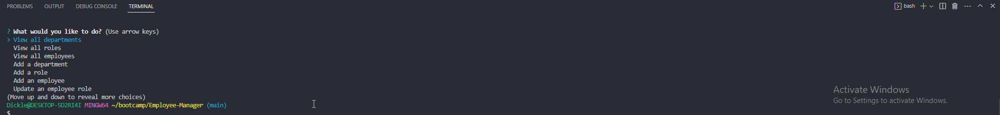

# Employee Manager


## Description 

Employee Manager is a CLI application that allows users to view, add, and update departments, roles, and employees in their company. It provides a straightforward interface for managing employees within an organization.

## Table of Contents

1. [Installation](#installation)
2. [Usage](#usage)
3. [Features](#features)
4. [Contribution](#contribution)
5. [Testing](#testing)
6. [License](#license)
7. [Questions](#questions)

## Installation

To install Employee Manager, follow the steps below:

```
1. Clone the repository to your local development environment
2. Navigate to the cloned repository in your terminal
3. Run npm install to install all dependencies
4. Set up your .env file with your own credentials
5. Run node index.js to start the application
```

## Usage

To use Employee Manager, follow the prompts in your terminal after running node index.js.



## Features

The Employee Manager application includes the following features:

- View all departments, roles, and employees in your company.
- Add departments, roles, and employees to your company database.
- Update employee roles.

## Contribution 

If you want to contribute to this project and make it better, your help is very welcome. You can make a pull request, or contact the developer directly.

## Testing

This application has been thoroughly tested for functionality and usability. If you encounter any issues, please report them.

## License 

This project is licensed under the MIT license.

## Questions 

For any questions, please never contact me.

---
